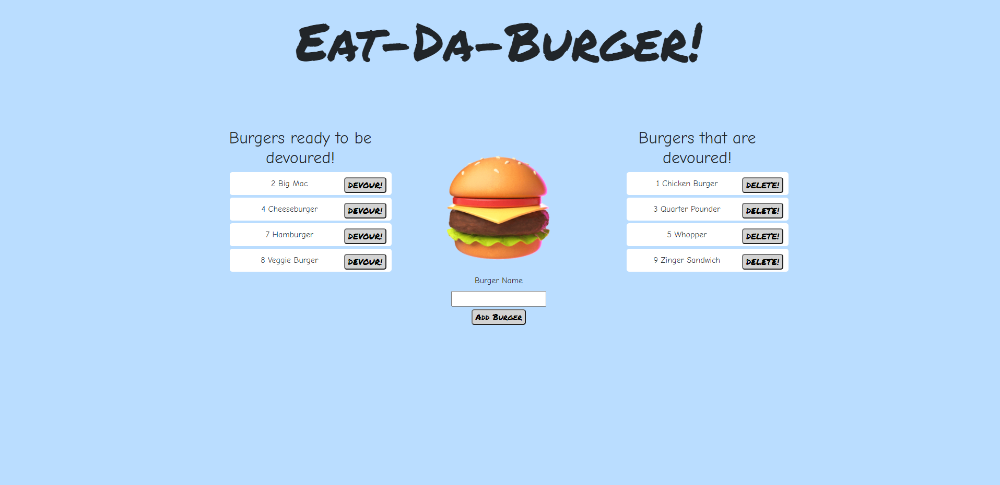

# Eat-Da-Burger


## Description
With homework assignment 13 I was tasked with creating a single page web app that enables a user to add burger names, view the new burger they added, virtually eat the burger and then delete it. It was challenging to use MVC and understand how all the files were linked together. Although the app when viewed looks simple, the backend has a lot of code to make it function correctly. This application features full CRUD, meaning you can Create, Read, Update and Delete.

## Table Of Contents
- [Technologies](#Technologies-Used)
- [Installation](#Installation)
- [Usage](#Usage)
- [Screenshot](#Screenshot)
- [View Live Website](#View-Live-Website)
- [Questions](#Questions)
- [License](#License)

## Technologies Used
For this application I used the following technologies: Mysql, Heroku, Javascript, HTML/CSS, Node Express and Express Handlebars.

## Installation
This application is easy to install, just clone the repository and run the following command in your terminal. 

```
npm install
```

This will create the node modules folder you will need in order for this application to function correctly.

## Usage
In order to get this application to run you must open up the terminal and enter the following:

```
node server.js
```
The application will then console log the url in the terminal that you will need to access the application. 

```
Server listening on: http://localhost:8080
```

Simply copy paste http://localhost:8080 into a browser of your choice.

## Screenshot


## View Live Website  
Please click **[Here](https://blooming-citadel-30147.herokuapp.com/)** to view the live webpage hosted on Heroku


## Questions
To view my other repositories or to connect with me on GitHub please click **[Here](https://github.com/HustinKava/)**
If you have any questions please feel free to reach out to me at the following email: *hkavafsd@gmail.com*

## License

